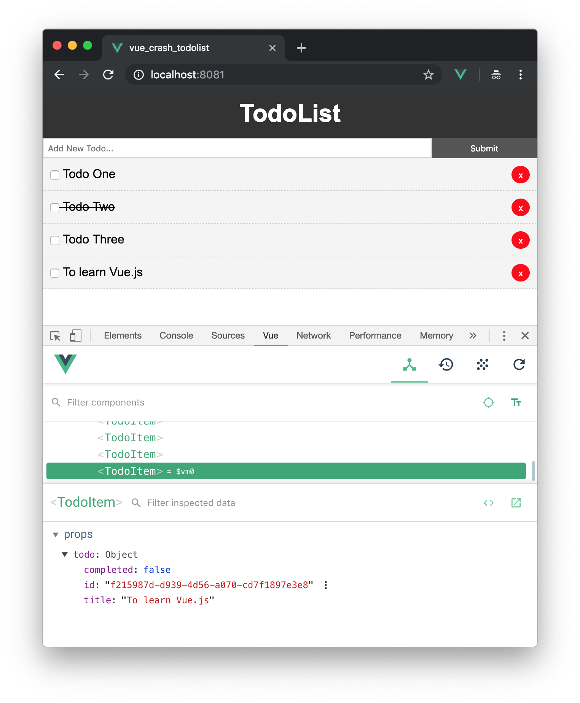

# Vue Crash Course (TodoList)

Project created according to the Traversy's Media tutorial [Vue JS Crash Course 2019](https://www.youtube.com/watch?v=Wy9q22isx3U) - 
good way to start to learning Vue.js - a progressive, incrementally-adoptable JavaScript framework for building UI on the web.

* You will need to install:
    + [uuid library](https://github.com/kelektiv/node-uuid)
    + [axios](https://github.com/axios/axios)
    + [vue-router](https://github.com/vuejs/vue-router)

* Is used [JSONPlaceholder](https://jsonplaceholder.typicode.com/) - Fake Online REST API for Testing and Prototyping,
to implement the part of http REST requests from our Vue.js frontend web application

**Screenshots:**

